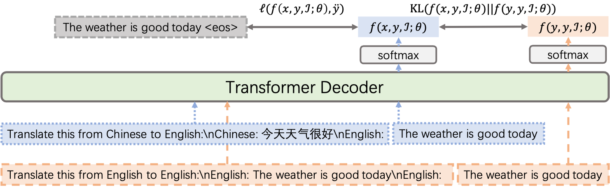

# Towards Boosting Many-to-Many Multilingual Machine Translation with Large Language Models
This repository contains the PyTorch implementation (**Unofficial**) for our arXiv paper "[Towards Boosting Many-to-Many Multilingual Machine Translation with Large Language Models](https://arxiv.org/abs/2401.05861)".



## Requirements and Installation

This work has been tested in the following environment.

* Python version == 3.8.5
* PyTorch version == 2.2.0
* Sacrebleu version == 2.3.1
* Comet version == 2.0.2

To install llama-recipes and develop locally:
```bash
cd llama-recipes
pip3 install -U pip setuptools
pip3 install --extra-index-url https://download.pytorch.org/whl/test/cu118 -e .
```

## Reproduction

The following instructions can be used to low-rank adaptation (LoRA) finetune the [ALMA-13B-Pretrain](https://huggingface.co/haoranxu/ALMA-13B-Pretrain) model with cross-lingual consistency regularization.

### Preprocessing

The datasets used for ALMA experiments can be found in the `dataset/experiment_alma` directory. The datasets used for LLaMA-2 experiments can be found in the `dataset/experiment_llama2` directory.

Preprocess the data:
```bash
# Prepare the training data
python3 generate_json.py
```

### Training

Finetune the ALMA-13B-Pretrain model with cross-lingual consistency regularization. 

```bash
DATA=wmt_test-flores200_dev.cs_de_ru_zh.json
PROMPT=gpt-mt
ALPHA=0.1
CKPT=ALMA-13B-Pretrain-PEFT-MT-${PROMPT}-alpha01

mkdir -p logs

torchrun --nnodes 1 --nproc_per_node 8 llama-recipes/examples/finetuning.py --dataset translation_dataset --prompt_type ${PROMPT} \
    --data_path ${DATA} \
    --model_name ALMA-13B-Pretrain \
    --num_epochs 1 --batch_size_training 4 \
    --lr 1e-4 --gradient_accumulation_steps 8 \
    --use_peft --peft_method lora --output_dir ${CKPT} \
    --enable_fsdp --use_fast_kernels \
    --xconst_alpha ${ALPHA} \
    1>logs/EXP.out 2>logs/EXP.err
```

### Evaluation

Evaluate our trained model on English to German translation direction (as an example):

```bash
FOLDER=dataset/experiment_alma/testset/wmt22/eng_Latn-deu_Latn
PROMPT=gpt-mt
CKPT=ALMA-13B-Pretrain-PEFT-MT-${PROMPT}-alpha01

python3 translate.py --fin ${FOLDER}/test.eng_Latn --fout ${FOLDER}/test.eng_Latn.en2de_translation \
    --ckpt ${CKPT} --src English --tgt German --prompt gpt-mt


SRC=${FOLDER}/test.eng_Latn
HYP=${FOLDER}/test.eng_Latn.en2de_translation
REF=${FOLDER}/test.deu_Latn

# Calculate the BLEU score
sacrebleu -tok 13a -w 2 ${REF} < ${HYP}

# Calculate the COMET score
CKPT=wmt22-comet-da/checkpoints/model.ckpt

python3 compute_comet.py --ckpt ${CKPT} --file_src ${SRC} --file_hyp ${HYP} --file_ref ${REF}
```

### Result

The overall performance (SacreBLEU / COMET) is summarized as follows. Please note that the experimental result is slightly different from that in the paper.

| Method          | Supervised Average | Zero-shot Average | 
|-----------------|--------------------|-------------------|
| ALMA-13B-LoRA   | 34.23 / 85.62      | 13.96 / 70.27     |
| &emsp; + XConST | 34.11 / 85.63      | 23.86 / 86.69     |

## Citation

If you find the resources in this repository helpful, please cite as:
```
@article{gao2024xconst,
  title={Towards Boosting Many-to-Many Multilingual Machine Translation with Large Language Models},
  author={Gao, Pengzhi and He, Zhongjun and Wu, Hua and Wang, Haifeng},
  journal={arXiv preprint arXiv:2401.05861},
  year={2024}
}
```
